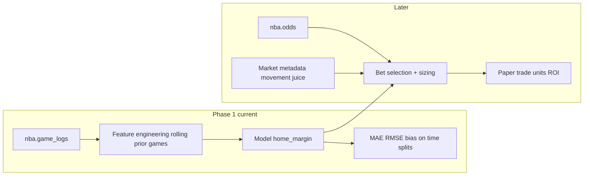

# Plan: Home-margin model from game logs (no odds in training)

## Motivation (big picture)

- **Stage 1 (this plan)**: learn E[\text{home_margin}] from historical performance only (no odds). This produces a portable “team strength / form” signal that can be computed pregame using prior-only features.
- **Stage 2 (later)**: ingest live odds + market metadata (open/close, movement, price/juice, market/team effects) and use Stage 1 predictions to identify games where the market line deviates enough to create +EV.

## Scope (locked)

- **Inputs**: `[sql/game_logs.sql](sql/game_logs.sql)` — features derived from `nba.game_logs` only.
- **Target**: `home_margin` on the **home** row (`home == true`); one row per `game_id` (dedupe like `[notebooks/benchmark.ipynb](notebooks/benchmark.ipynb)`).
- **Odds**: **Not** used for features, labels, or validation in this phase. The existing `[notebooks/benchmark.ipynb](notebooks/benchmark.ipynb)` run (~MAE **10.47** pts, RMSE **13.50** pts on spread residuals) is the **external book benchmark** to revisit **after** the model is trained, when you layer odds for +EV.

**Important distinction**: The notebook’s MAE is on **cover residuals** `residual = home_margin + spread` (line vs outcome). Your model’s first metrics will be **raw margin error** `|pred - home_margin|` (and RMSE). Those numbers are not identical; when you later add odds, you can compare **your** predicted margin to the line the same way the notebook does (e.g. implied cover error vs books).

## Evaluation plan (margin now, units later)

- **Phase 1 (margin skill)**: use time-ordered splits / walk-forward CV and report MAE, RMSE, and bias on held-out periods for `home_margin`.
- **Phase 2 (betting skill, later)**: after adding odds/market features and a bet-selection layer, run a paper-trading simulation that computes unit P&L (net of vig) using only information available at the simulated timestamp.

## Final untouched holdout (locked)

- **Do not use for tuning, feature selection, or threshold selection**.
- **Holdout period**: **2025 playoffs** + **2025–26 regular season**.
- **Use**: final reporting for both:
  - **Phase 1** margin metrics (MAE/RMSE/bias on `home_margin`)
  - **Phase 2** end-to-end simulated betting metrics (units, ROI, drawdown), once odds layers exist

## Data and leakage rules

- Build a **game-level** table: `game_id`, `date`, `home_margin`, plus opponent/context fields you need (from the home row: `opp`, `team`, etc.).
- **Features** must use only information **strictly before** game time (typically: rolling / expanding stats from **prior** games for home team, away team, and optionally matchup-neutral signals). Enforce this with **date-ordered splits** or **walk-forward** validation — never random shuffle across time.
- Schema reference: `[nba.game_logs](sql/game_logs.sql)` includes advanced box-style columns (`ortg`, `drtg`, `pace`, percentages, etc.) — good candidates for rolling aggregates after you align to one row per game.

## Modeling approach (practical default)

1. **Baselines** (same splits): e.g. predict `0` every game; predict league rolling mean margin; predict from simple team rolling point differential. These quantify whether ML adds value on logs alone.
2. **Main model**: Start with a strong tabular baseline (**gradient boosting**, e.g. LightGBM / XGBoost / sklearn HistGradientBoosting) on engineered features. Linear/ridge optional as a sanity check.
3. **Metrics**: MAE, RMSE, mean bias on held-out periods; optional calibration plots (pred vs actual).

## Walk-forward validation: expanding vs rolling (two different “windows”)

Keep these separate:

- **Feature windows** (rolling aggregates): “last *n* games before this game” for team stats — almost always **rolling** (fixed *n*), not expanding, so every row uses comparable signal length.
- **Training window for CV** (how much history the model sees when fitting each fold):
  - **Expanding train**: each fold trains on all games from a fixed start through cutoff *t*, tests on the next block. Maximizes data; older seasons may not match today’s NBA.
  - **Rolling train**: each fold uses only the last *W* games or *W* days before *t*, then tests forward. Stresses recent behavior (closer to deployment); less data per fit and *W* is another hyperparameter.

**Suggestion**: Start with **expanding** walk-forward (with a **burn-in** period, e.g. skip early season days until each team has enough prior games for features). If validation error is noisy or you suspect regime shift, try a **rolling** train window (e.g. last ~1–1.5 seasons of games) and compare MAE on the same test blocks.

## How many games back for rolling features (*n*)

Reasonable defaults (you can expose several at once):

- **Short form**: **last 3–5** games — captures streaks; noisy.
- **Medium**: **last 10** games — common default for team-level summaries.
- **Smoother rates** (efficiency-style): **last 15–25** games — stabler; lags real changes.

Practical recipe: build **multiple** horizons (e.g. 5, 10, 20) as separate columns so the model can weight them; if you want one knob only, **10** is a solid first value.

## Should you grid-search *n* with `GridSearchCV`?

- **Yes, but only inside time-safe CV.** Use `TimeSeriesSplit` or a **manual walk-forward** — never default `KFold` or shuffled splits (that leaks future games into training).
- **Tuning *n*** over a **small grid** (e.g. `{5, 10, 15, 20}`) or including *n* in a **Pipeline** is reasonable.
- **Caveat**: if you also tune many model hyperparameters, prefer **nested** time-aware CV (outer walk-forward for honest error, inner for tuning) or keep the grid small to avoid overfitting the validation timeline.

**Simpler alternative**: fix *n* ∈ {10, 15} from domain knowledge, tune only model params (depth, learning rate, min samples) with `TimeSeriesSplit`.

## Where code should live

- You already touched `[nba_spreads/ML/](nba_spreads/ML/)` (`model.py`, `pipeline.py`). A clean split is:
  - **SQL or pandas**: load `game_logs`, build game-level + rolling features.
  - `**pipeline.py`**: split logic, training, evaluation, artifact save (e.g. joblib).
  - `**model.py`**: model wrapper / hyperparameters.

Alternatively, a first exploratory pass can live in a **new notebook** that mirrors benchmark style (load from DB, evaluate) — but keep training logic in importable modules once stable.

## Dependencies / environment

- Reuse existing stack (`[sqlalchemy](notebooks/benchmark.ipynb)`, `pandas`, `numpy`). Add one boosting library if not already in the project’s dependency file when you implement.

## Later phase (explicitly out of scope now)

- Load model predictions next to `nba.odds` and reuse the benchmark notebook’s **join + residual** logic to find games where betting either side of the spread has positive EV (only after margin model + uncertainty are acceptable).

